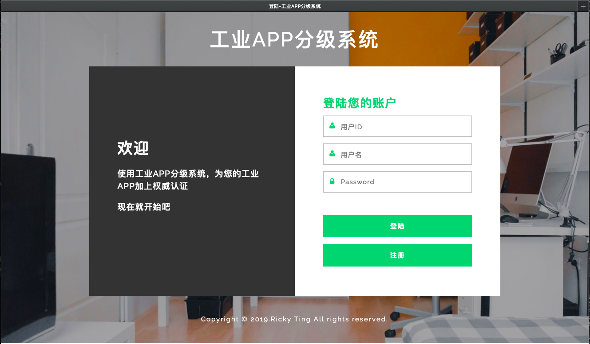
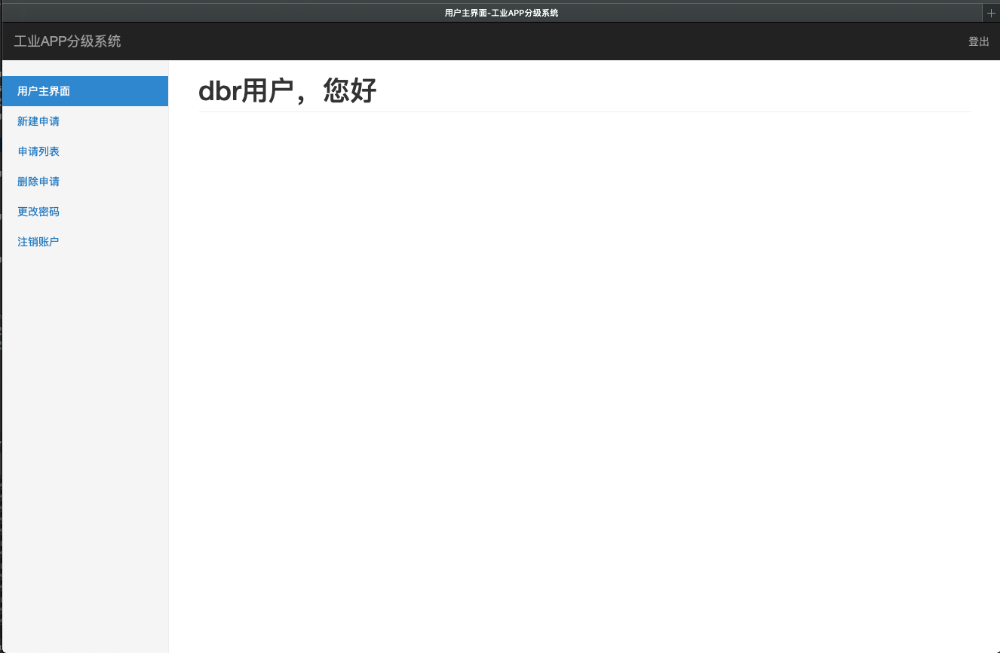
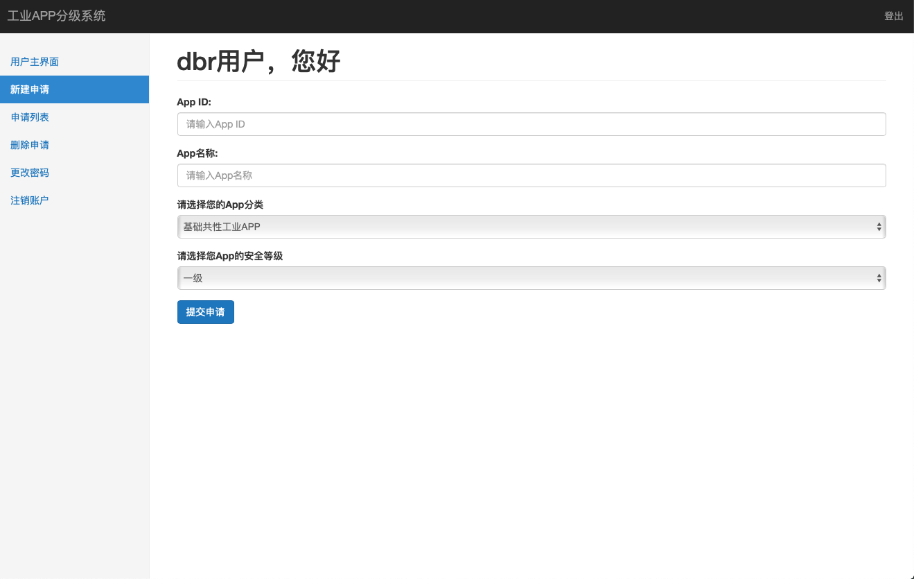
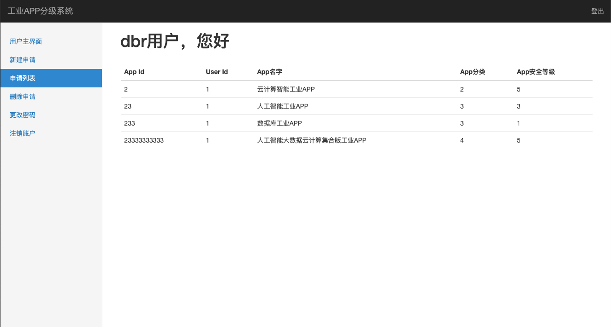
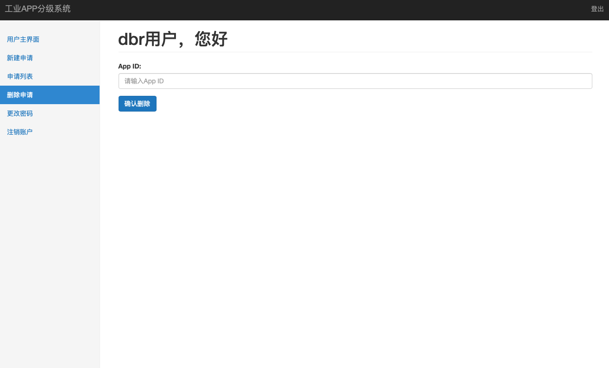
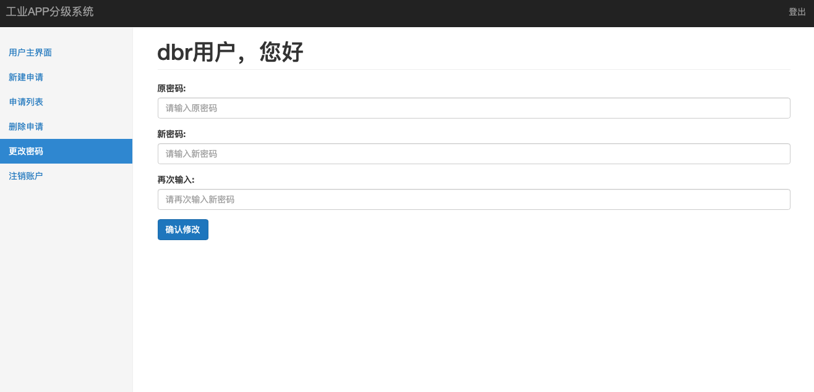
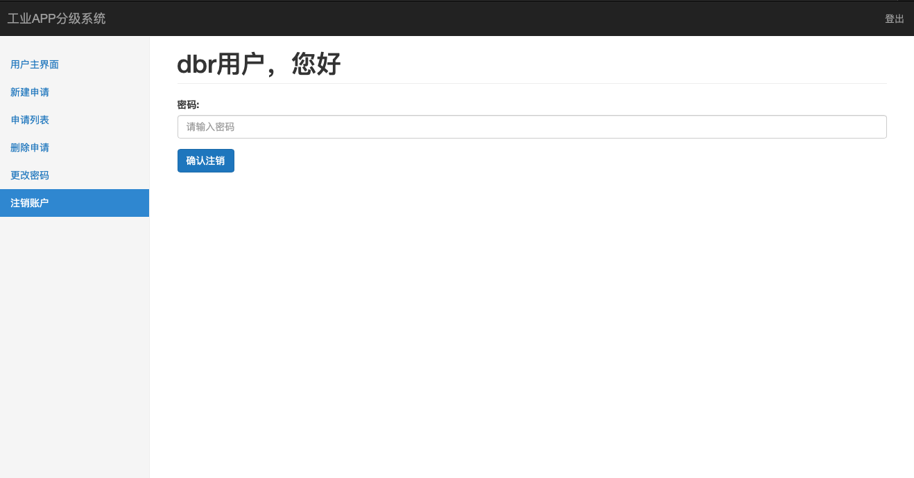

# 工业APP分级系统

## 系统概述

本实验为"软件工程"的课内实验，耗时约3-4天。实验成品为一个支持用户登录，注册，提交申请、删除申请、查看申请等一系列功能的前后端网站。

### 依赖

* Spring Boot: 框架
* MySQL: 后端数据库
* Bootstrap: css
* Thymeleaf: 用于支持动态页面

### 效果

#### 登录界面

#### 注册页面

#### 用户主界面

#### 新建申请

#### 申请列表

#### 删除申请

#### 修改密码

#### 用户注销

